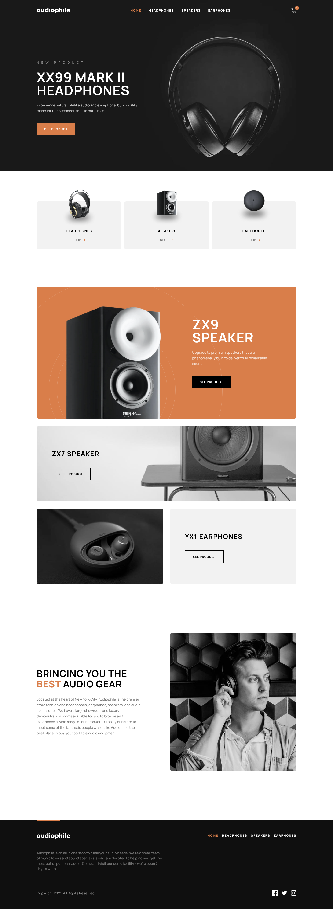

# Frontend Mentor - Audiophile e-commerce website solution

This is a solution to the [Audiophile e-commerce website challenge on Frontend Mentor](https://www.frontendmentor.io/challenges/audiophile-ecommerce-website-C8cuSd_wx). Frontend Mentor challenges help you improve your coding skills by building realistic projects.

## Table of contents

- [Overview](#overview)
  - [The challenge](#the-challenge)
  - [Screenshot](#screenshot)
  - [Links](#links)
- [My process](#my-process)
  - [Built with](#built-with)
  - [What I learned](#what-i-learned)
  - [Continued development](#continued-development)
- [Author](#author)

## Overview

### The challenge

Users should be able to:

- View the optimal layout for the app depending on their device's screen size
- See hover states for all interactive elements on the page
- Add/Remove products from the cart
- Edit product quantities in the cart
- Fill in all fields in the checkout
- Receive form validations if fields are missed or incorrect during checkout
- See correct checkout totals depending on the products in the cart
  - Shipping always adds $50 to the order
  - VAT is calculated as 20% of the product total, excluding shipping
- See an order confirmation modal after checking out with an order summary
- **Bonus**: Keep track of what's in the cart, even after refreshing the browser (`localStorage` could be used for this if you're not building out a full-stack app)

### Screenshot

### Links

- Solution URL: [https://github.com/AceDub/audiophile-ecommerce](https://github.com/AceDub/audiophile-ecommerce)
- Live Site URL: [https://audiophile-acedub.vercel.app/](https://audiophile-acedub.vercel.app/)

## My process

### Built with

- Semantic HTML5 markup
- Flexbox
- CSS Grid
- Mobile-first workflow
- [React](https://reactjs.org/) - JS library
- [Next.js](https://nextjs.org/) - React framework
- [Tailwind CSS](https://tailwindcss.com/) - CSS framework
- [TypeScript](https://www.typescriptlang.org/) - JS superset
- [Redux Toolkit](https://redux-toolkit.js.org/) - State management
- [Redux Persist](https://github.com/rt2zz/redux-persist) - Persist state to local storage
- [React Hook Form](https://react-hook-form.com/) - Form validation with Yup Schema
- [React Toastify](https://fkhadra.github.io/react-toastify/introduction/) - Toast notification
- [Headless UI](https://headlessui.dev/) - UI components and transition

### What I learned

This was the largest project I have taken on so far. At the beginning stages of development, I had felt overwhelmed thinking that I wouldn't be able to complete this challenge. There was a lot that I did not know how to implement, along with different dependencies I've never used. To get over the feeling of being overwhelmed, I learned to break down the project into smaller pieces and complete them one at a time. With each component I completed, I gained more confidence in my ability to complete the project.

At the time of starting this project, NextJS 13 was in beta. Since it was fairly new, I had to rely on the documentation. Taking the time to read the documentation was a huge help in not only understanding NextJS 13, but also other dependencies I used in this project. With this newfound discovery of how great documentation can be, I felt as though I would be able to utilize any new dependencies that I have not used before. I've always known that it was important, but I never really took the time to read it. I would usually just look at the examples or use Google and try to figure out how to implement it in my project. I've learned that reading the documentation is just as important as looking at examples or relying on Google/StackOverflow.

I was able to learn a lot with this project, such as using Redux Toolkit for state management, React Hook Form for form validation, and Headless UI for UI components and transitions. I also feel as though I have gotten better with using React and Tailwind CSS. This project has helped me gain more confidence in my ability to complete projects and has helped me realize that I am capable of learning new things.

### Continued development

Throughout this project, I would often run into a TypeScript error that I would struggle to fix. I would like to be more comfortable with using TypeScript so I can utilize it better in future projects. I will also continue to learn more about React and NextJS. Taking on more challenging projects will help me learn and grow as a developer.

## Author

- Frontend Mentor - [@AceDub](https://www.frontendmentor.io/profile/AceDub)
- GitHub - [@AceDub](https://github.com/AceDub)
